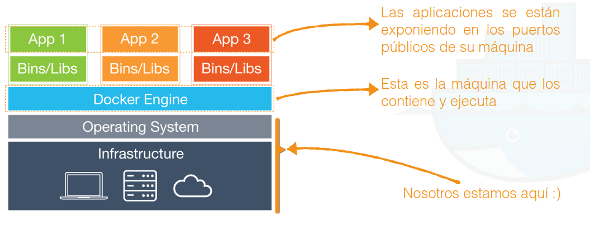
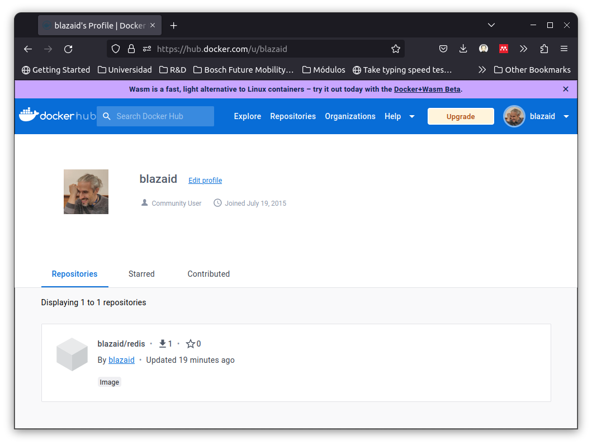

# Prerequisitos

Para poder seguir el curso es necesario tener instalado Docker

- En <https://docs.docker.com/engine/install/> las indican las plataformas soportadas
- Ubuntu GNU/Linux: <https://docs.docker.com/engine/install/ubuntu/>
  - También existe versión desktop: <https://docs.docker.com/desktop/install/linux-install/>
- MacOS: <https://docs.docker.com/desktop/install/mac-install/>
- Windows: <https://docs.docker.com/desktop/install/windows-install/>

En el escritorio virtual de la UPM ya está instalado, así que genial

---

# ¿Para qué necesitamos _Docker_?<!--_class: section-->

---

<div class="columns center">
  <div class="column">
    
  </div>
  <div class="column">
    
  </div>
</div>

<center>
  El despliegue de aplicaciones es la nueva compilación
</center>

---

# Escenarios clásicos

- Desplegar un servidor de estáticos
- Desplegar un cliente de correo
- Desplegar un Wordpress dedicado
- Replicar una base de datos para solo lectura
- Aplicación web con múltiples componentes (p.ej. Python + uWSGI + Nginx + ...)

---

# Generalmente tenemos que acordarnos de muchas cosas

Hay que actualizar el sistema operativo y las dependencias periódicamente

Cuidado de no comprometer las cuentas de usuario del servidor en el que trabajamos

Revisar las políticas del _firewall_ para permitir el acceso a los puertos

Programar _backups_ de todo (i.e. configuración, datos, aplicaciones, ...)

Establecer un ciclo de integración y despliegue continuo

Activar la monitorización de los servicios activos, accesos, ...

---

# Pero... ¿qué pasa si a los pocos meses...

... la infraestructura no funciona como se esperaba?

... la empresa decide cambiar de proveedor de servicios?

... el sistema operativo deja de ser soportado o cambia?

... sufrimos un pico de tráfico inesperado y hay que escalar rápidamente?

... se sobredimensionó la infraestructura y hay que reducir costes?

---

# Pues pasaría que...

... los más novatos empezarían desde cero

... los más experimentados volverían a utilizar scripts de cosecha propia

... los expertos tendrían un plan de contingencia para muchos de estos problemas

<center>

  **Pero pocos estarían 100% seguros de todo volvería a funcionar como antes**
</center>

---

# Soluciones posibles

Delegar en la solución de un tercero

- Problemas de _vendor lock-in_

Máquinas virtuales

- Muy lentas
- Difíciles de desplegar y mantener
- Desperdicio de recursos
- **¿... o no?**

---

# La solución actual: _Docker_<!--_class: section-->

---

<center>

  
</center>

---

# Imágenes

**Plantillas** con código, dependencias y configuración para ejecutar una aplicación

- Son como paquetes preconfigurados para crear y ejecutar contenedores de Docker
- Son **creadas a partir** de un archivo de configuración llamado **Dockerfile**
- Se pueden compartir y reutilizar a través de Docker Hub o repositorios privados
- Son de **sólo lectura** y por tanto **inmutables**

**Se estructuran en capas**

- Cada una representa un cambio en la imagen sobre la que se basa
- Las capas se almacenan en caché para acelerar la creación de nuevas imágenes
- Esto permite una **gran eficiencia** en términos de almacenamiento y tiempo de construcción

---

# Contenedores

Son **instancias ejecutables de una imagen**

- Encapsulan parte del software de un sistema con todo lo necesario para ejecutarse
- Garantiza que **siempre** se ejecutan sistemas **idénticos** independientemente del entorno

**Cada contenedor** se ejecuta en su propio espacio de **proceso aislado**

- Y por tanto pueden tener sus propias bibliotecas, configuración y demás recursos
- Y que **no interferirá con otros contenedores** que se ejecuten en el mismo host

Los **contenedores** de Docker son **ligeros**, rápidos y fáciles de crear y destruir

- Esto los hace ideales para la creación de aplicaciones distribuidas y escalables

---

# Pero... ¿esto no son máquinas virtuales?

Las máquinas virtuales son máquinas emuladas, los contenedores comparten el kernel

<center>

  
</center>

---

# Repositorios y registros (_index_ o _registry_)

Un repositorio es un **almacén de imágenes**

- Permite almacenar una o más versiones de una misma imagen de Docker
- Una imagen puede tener una o más versiones (etiquetas)

Existen servicios de alojamiento de repositorios

- Son los **registros**, y sirven como almacenamiento de **colecciones de repositorios**

Los repositorios como los registros pueden ser **públicos** (p.ej. [DockerHub](https://hub.docker.com/)) o **privados**


---

# Las verdaderas ventajas de Docker

- Acelera la puesta a punto
- Favorece la experimentación a nivel de arquitectura
- Elimina las inconsistencias del entorno (adios "en mi máquina funciona")
  - O funciona, o no funciona

---

# ¿Cómo funciona?

<center>

  

</center>

---

# Vamos a por la terminal<!--_class: section-->

---

# Obteniendo la versión de docker

Versión corta:

```bash
$ docker -v
Docker version 23.0.1, build a5ee5b1
```

Versión larga:

```bash
$ docker version
Client: Docker Engine - Community
 Version:           23.0.1
 API version:       1.42
 Go version:        go1.19.5
 Git commit:        a5ee5b1
 Built:             Thu Feb  9
 ...
```

---

# Obteniendo información del entorno

```bash
$ docker info
...Server:
 Containers: 1
  Running: 0
  Paused: 0
  Stopped: 1
 Images: 1
...
 OSType: linux
 Architecture: x86_64
 CPUs: 8
 Total Memory: 15.34GiB
 Name: vault18
 ...
 Docker Root Dir: /var/lib/docker
 Debug Mode: false
 Registry: https://index.docker.io/v1/
 ...
```

---

# El proceso de ejecución de un contenedor

```bash
$ docker container run hello-world
```

1. Se comunicará con el proceso (_daemon_) de Docker
2. Buscará la imagen en la caché local y, de no encontrarla, la descargará del registro
3. Creará un contenedor según lo indicado por dicha imagen que ejecuta un proceso
4. Se mostrará por la salida estándar (pantalla) la salida de la ejecución de la imagen
   - **Este mensaje es la salida de sus procesos en el contenedor**

```text
Unable to find image 'hello-world:latest' locally
latest: Pulling from library/hello-world
2db29710123e: Pull complete 
...
```

> **Nota:** Antes de docker 1.13 sólo estaba disponible el comando `docker run`. A partir de esa versión, se refactorizó todo el CLI para seguir la nomenclatura `docker COMANDO SUBCOMANDO`. El objetivo fue tener una agrupación más intuitiva de los comandos ya que su número ha crecido sustancialmente.
---

# Otro ejemplo: Levantando un servidor web nginx

```bash
$ docker container run -d -P --name web nginx
```

- `-d` indica que se ejecute en **segundo plano**
- `-P` expone los puertos del contenedor en el host
- `--name` le da un nombre al contenedor de forma local
- `nginx` es el nombre de la imagen que se va a ejecutar

Por cierto, 

---

# Listando los contenedores

```bash
$ docker ps
```

Nos indica los contenedores que están en ejecución

- En nuestro caso, el de nginx como daemon con el nombre `web`

```text
CONTAINER ID   IMAGE     COMMAND                  CREATED         STATUS         PORTS                                     NAMES
735762ef7e64   nginx     "/docker-entrypoint.…"   5 seconds ago   Up 3 seconds   0.0.0.0:32770->80/tcp, :::32770->80/tcp   festive_brahmagupta
```

---

# Listando sólo los puertos

```bash
$ docker port web
```

¿Pero por qué no funciona?

---

# Recordad la arquitectura

<center>


</center>

---

# Accediendo a los contenedores

```bash
$ docker inspect web
```

Nos dará toda la información sobre el contenedor de nombre `web`

- Incluyendo la IP y el puerto en el que está escuchando

Un comando para obtenerlo rápido:

```bash
$ docker inspect --format='{{range.NetworkSettings.Networks}}{{.IPAddress}}{{end}}' web
```

Si accedemos a la IP del contenedor por el puerto 80, veremos la página de nginx

---

# Parando contenedores

Si tenemos algun contenedor corriendo que queremos parar, podemos hacerlo con:

```bash
$ docker stop web
```


---

# Imágenes<!--_class: section-->

---

# `Pull`

Con `pull` nos descargaremos (sin ejecutar) una imagen de un registro

```bash
$ docker pull ubuntu
```

Esto nos descargará la última imagen de ubuntu

- Esto es, la imagen `ubuntu:latest`

---

# `Images`

La opción `images` mostrará las imágenes que tenemos en local

```bash
$ docker images
```

---

# Imagenes bajo demanda

Se puede reemplazar el comando a ejecutar de las imagenes:

```bash
$ docker container run ubuntu /bin/echo 'Hola mundo'
Hola mundo
```

Como `/bin/echo` no requiere nada nuevo, no se crea ninguna imagen nueva

- Y como no se queda en ejecución, el contenedor se destruye una vez ha terminado

---

# _Logs_

Podemos listar los contenedores que han estado en ejecución añadiendo `-a` a `ps`

```bash
$ docker ps -a
```

Así sabemos el nombre (o el id) del contenedor que ha estado en ejecución

Luego, basta con usar `logs` para ver los logs de dicho contenedor

```bash 
$ docker logs web
```

---

# Monitorización y enganche a contenedores

Podemos arrancar de nuevo contenedores que estaban en ejecución con `start`

```bash
$ docker start web
```

Con el contenedor en ejecución , podemos monitorizar los logs con `logs -f`

```bash
$ docker logs -f web
```

Y también monitorizar su uso de recursos con `stats`

```bash
$ docker stats
```

Por último, podemos engancharnos a contenedores en ejecución con `attach`

```bash
$ docker attach web
```

---

# Consola interactiva

Podemos ejecutar un contenedor con una consola interactiva con `run -it`

```bash
$ docker run -it ubuntu
```

- `-i` indica que se ejecute en modo interactivo
- `-t` indica que se ejecute con una consola

Dentro podemos ejecutar comandos como si estuviesemos en otra máquina

- Que de hecho lo estamos

```bash
root@b9b5b0b5b0b5:/# ls
bin   dev  home  lib64  mnt  proc  run   srv  tmp  var
```

---

# Ejemplo: Servidor de redis en nuestro contenedor

Al final un contenedor es una máquina y podemos alterarla como queramos

```bash
root@b9b5b0b5b0b5:/# apt update && apt -y upgrade && apt install -y redis-server
...
root@b9b5b0b5b0b5:/# service redis-server start
...
root@b9b5b0b5b0b5:/# ps -ef | grep redis
USER  PID %CPU %MEM   VSZ  RSS TTY STAT START TIME COMMAND
redis 474  0.3  0.4 37000 8736   ?  Ssl 10:23 0:00 /usr/bin/redis-server 127.0.0.1:6379
```

Y todo sucede **dentro del contenedor**

---

# Creando nuestras propias imágenes <!--_class: section-->

---

# A través de _commit_

Hacer _commit_, como en los VCS, es **tomar una instantánea del contenedor**

- Vamos, lo que conocemos como **imagen**
- Puede ser un contenedor en ejecución o uno que ya ha terminado

```bash
docker commit <container> <image>
```

Por ejemplo, nuestro contenedor de redis:

```bash
$ docker ps -a
CONTAINER ID   IMAGE     COMMAND       CREATED          STATUS                       PORTS     NAMES
49632a5d8448   ubuntu    "/bin/bash"   57 seconds ago   Exited (127) 3 seconds ago             bold_khayyam
$ docker commit bold_khayyam blazaid/redis
sha256:521224a391e23bf3220bdeebd5827691d1f0dcd5298c5ff5cf0ca8eb9ca139f9
$ docker images
```

Así podemos replicar tantos contenedores como queramos a partir de esta imagen

---

# A través de _Dockerfiles_ (I)

Un _Dockerfile_ es un archivos de texto con las instrucciones para crear una imagen

- El formato es muy sencillo: Lista de `INSTRUCCIÓN ARGUMENTO`
- Los comentarios empiezan por `#`
- La primera instrucción debe ser `FROM` (la imagen de la que partimos)
- NO es _case sensitive_
- **Algunas instrucciones generan capas** (como `RUN` o `COPY`) y otras no
- El **orden** de las instrucciones **importa**

El equivalente al anterior ejemplo sería:

```dockerfile
FROM ubuntu
RUN apt update && apt -y upgrade && apt install -y redis-server
CMD service redis-server start
```

---

# Dockerfiles (II)

Si que estamos en el directorio del anterior `Dockerfile`, creamos la imagen con:

```bash
$ docker build -t blazaid/redis .
```

- `-t` indica el nombre de la imagen
- `.` indica el directorio donde está el `Dockerfile` (en este el directorio actual)

Esto crea nuestra imagen `blazaid/redis`, la cual podemos usar para crear contenedores

```bash
$ docker run -d blazaid/redis
```

---

# Publicando nuestras imágenes<!--_class: section-->

---

# ¿Para qué queremos publicar nuestras imágenes?

Al igual que con los repositorios de código, podemos publicar nuestras imágenes

- Esto nos permite compartirlas con otros desarrolladores, ya sea de forma privada o pública

Además, la idea de una imagen es que sea **reutilizable**

- Si solo la teneos en nuestra máquina, no sirve para nada
- O sí, pero hasta que la borramos o la cambiamos

Las imágenes se publican en **registros de imágenes**

- El de por defecto es [DockerHub](https://hub.docker.com)
- Es necesario crear una cuenta para poder publicar imágenes

---

# ¿Cómo publicar nuestra imagen?

1. Identificarnos en el registro de imágenes

```bash
$ docker login
```

2. Construimos la imagen

```bash
$ docker build -t blazaid/redis .
```

3. Publicamos la imagen

```bash
$ docker push blazaid/redis
```

---

# Mientras tanto, en [DockerHub](https://hub.docker.com) ...



---

# ¿Qué hacer con nuestras imágenes publicadas?

Ya sabemos que docker, si no encuentra la imagen en local, la busca en el registro

```bash
$ docker run -d blazaid/redis
```

También podemos descargar la imagen directamente con `pull`

```bash
$ docker pull blazaid/redis
```

Y también podemos taggear la imagen para que se publique con otro nombre

```bash
$ docker tag blazaid/redis blazaid/redis:1.0.0
$ docker push blazaid/redis:1.0.0
```

Estas son las operaciones más comunes para trabajar con imágenes publicadas

---

# Puertos y enlaces<!--_class: section-->

---

# Puertos en contenedores

En docker, ningún contenedor expone puertos por defecto

Para exponer un puerto, debemos usar la opción `-p` o `--publish`

```bash
$ docker container run -d -p <ip-host>:<puerto-host>:<puerto-contenedor> imagen
```

- `<ip-host>`: IP de la máquina host (opcional, por defecto `127.0.0.1`)
- `<puerto-host>`: Puerto _mapeado_ en el host (opcional, por defecto aleatorio)
- `<puerto-contenedor>`: Puerto del contenedor al que queremos que apunte
- Además en los puertos podemos añadir los sufijos `/tcp` o `/udp` (or defecto `/tcp`)

```bash
$ docker container run -d -p 127.0.0.1:8080/udp:80/tcp imagen
$ docker container run -d -p 80 imagen
```

---

# Enlaces entre contenedores

Exponer un puerto no es tan útil como parece

- Es más cómodo enlazar dos contenedores por sus puertos de forma automática
- Esto es, independientemente del número de puerto que se exponga

De esta manera, no dejan de interesar los puertos como tal

```bash
$ docker container run -d --name redis-main redis
$ docker run -it --name gamequiz --link redis-main:redis ubuntu
```

- `--link` crea un enlace entre contenedores
- Los **puertos** acaban compartiéndose como **variables de entorno en contenedores**

---

# Volúmenes <!--_class: section-->

---

# ¿Qué son los volúmenes?

Los volúmenes son **directorios compartidos entre el host y el contenedor**

- Se pueden montar en cualquier punto del sistema de archivos del contenedor
- Pertenece al host, así que **no se borra al parar o eliminar el contenedor** que lo usa
- Permite la persistencia y los cambios en tiempo real sin apenas retraso

```bash
$ docker container run -d -v <nombre>:<directorio-contenedor>:<opciones> imagen
```

- `<nombre>`: Nombre del volumen (opcional, por defecto aleatorio)
- `<directorio-contenedor>`: Directorio del contenedor donde montar el volumen
- `<opciones>`: Opciones de montaje (opcional, por defecto `ro`)

---

Gracias<!-- _class: endpage -->
